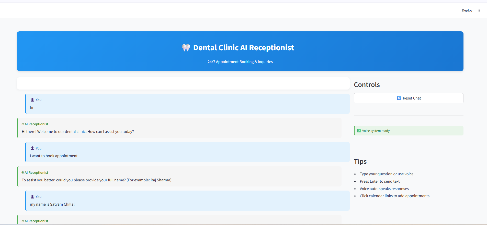
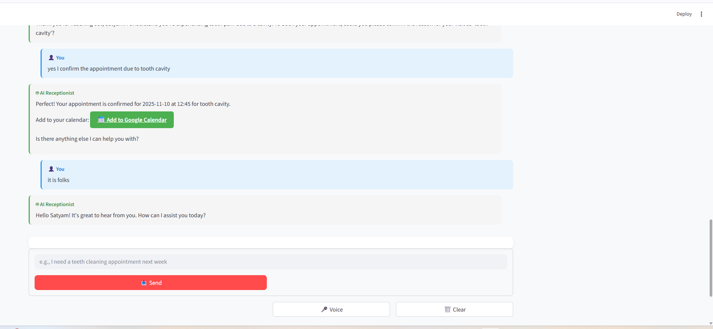

# 🦷 Dental AI Receptionist 🤖💬  

Your **smart 24×7 dental assistant** that helps manage appointments, client profiles, and friendly dental care conversations — all through **text 💬 or voice 🎙️!**

---

## ✨ What It Can Do  

- 👤 **Create new patient profiles** for first-time users  
- 🔍 **Check existing patients** and their appointment details  
- 🗓️ **Book new appointments** with a smart Q&A flow  
- 📅 **Add confirmed slots to Google Calendar** with one click  
- 🎙️ **Works in both Voice Mode & Text Mode**  
- 💾 **Stores data securely using SQLite** with two clean tables  

---

## 🧠 How It Works  

Powered by the **Cohere AI Model** (`command-a-03-2025`) and built on **LangChain**, this system uses a modular multi-agent design:  

- 💌 **Message Manager** – Handles user interactions  
- 📆 **Appointment Manager** – Books and manages schedules  
- 🧾 **SQL Manager** – Handles database queries and records  
- 💭 **General Query Handler** – Engages in casual dental discussions  

Each agent works independently yet collaboratively to ensure a smooth experience.  

---

## 🧰 Tech Stack  

| Technology | Purpose |
|-------------|----------|
| 🦜 LangChain | LLM orchestration & logic |
| 🗣️ pyttsx3 | Text-to-speech voice output |
| 🌐 Streamlit | Front-end interface |
| 🎧 streamlit-webrtc | Real-time voice processing |
| 💽 SQLite | Local database for clients & appointments |

---

## 🖼️ Preview  

Here’s a quick look at the interface:  

| Screenshot | Description |
|-------------|-------------|
|  | 🖥️ Chat interface showing conversation history |
|  | 🎙️ Voice & text input modes in action |

---

## ⚙️ Setup & Run  

1. **Install dependencies** 🧩  
   ```bash
   pip install -r requirements.txt
   ```

2. **Run the app** 🚀

   ```bash
   streamlit run app.py
   ```

That’s it! Your Dental AI Receptionist is ready to welcome patients — any time, any day! 🦷💫

---

## 💡 Future Enhancements

* 🔔 Smart reminders for upcoming appointments
* 📈 Patient history analytics
* 🌍 Multi-language support

---

### 🧑‍💻 Built with ❤️ by Satyam Chillal


> “Bringing smiles to tech and teeth alike.” 😁
